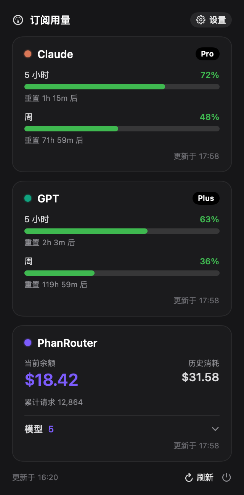
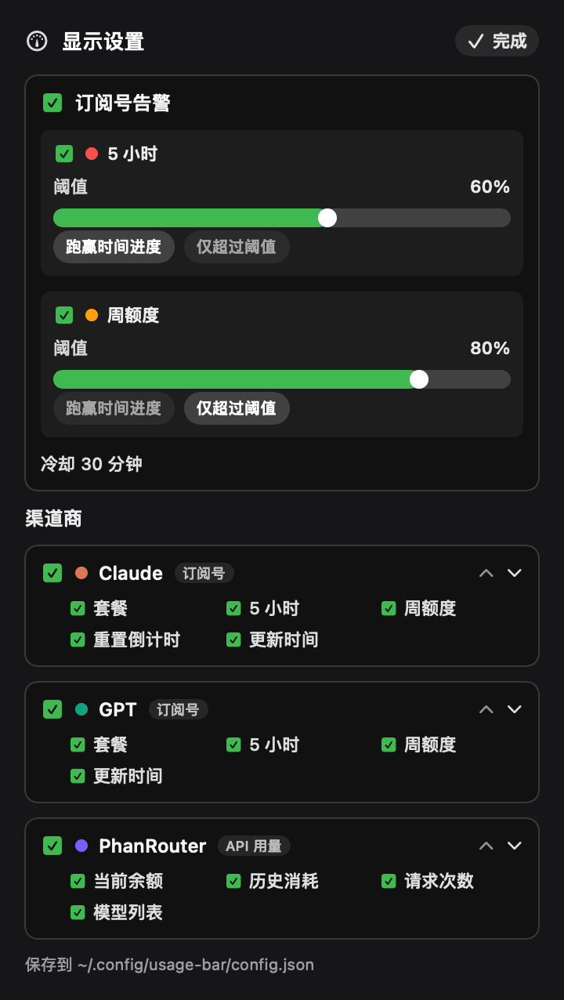

# TokenDeck · AI 用量控制台

<p align="center">
  <a href="https://www.apple.com/macos/"></a>
  <a href="https://www.swift.org/"></a>
  <a href="https://v2.tauri.app/"></a>
  <a href="https://developer.android.com/about/versions/nougat"></a>
</p>

<p align="center">
  <a href="#启动"><strong>▶ 快速开始</strong></a>
  &nbsp;·&nbsp;
  <a href="#界面"><strong>🖼️ 界面预览</strong></a>
  &nbsp;·&nbsp;
  <a href="tauri/README-android.md"><strong>📱 Android 构建</strong></a>
</p>

TokenDeck 把 **macOS 原生菜单栏看板**、**Windows 系统托盘客户端**和 **Android App / 主屏小组件**
放在同一套工程中，统一查看 Claude、Codex 与 New-API 兼容渠道的订阅窗口、余额和历史消耗。

macOS 端负责读取本机持续更新的登录凭证并聚合用量；Android 端可通过 Tailscale 连接 Mac
上的中转服务，避免在手机侧重复处理 OAuth、代理与凭证刷新。

## 启动

### macOS

```bash
./build-app.sh
open TokenDeck.app

# 建议安装到稳定路径后再开启“开机自启”
cp -R TokenDeck.app /Applications/
open /Applications/TokenDeck.app
```

`build-app.sh` 会执行 Release 编译、组装 `TokenDeck.app`、嵌入图标并完成
ad-hoc 签名。菜单栏图标右键可开启基于 `SMAppService` 的开机自启。

从旧名 `TokenUsageDashboard.app` 升级时，先在旧 App 中关闭开机自启并退出，再安装
`TokenDeck.app`，最后重新开启一次开机自启。两者沿用同一 Bundle ID，但不应同时保留为登录项。

### Windows

```powershell
cd tauri
npm install
npm run tauri dev

# 生产构建
npm run tauri build
```

构建产物为 NSIS 安装包。Windows 工具链、配置路径和凭证位置见
[tauri/README.md](tauri/README.md)。

### Android

```bash
cd tauri
npm install
npx tauri android build --debug --target aarch64
```

Android SDK、NDK、签名包、国内网络和真机运行说明见
[tauri/README-android.md](tauri/README-android.md)。

## 能力

- **订阅窗口**：Claude / Codex 展示 5 小时与周窗口的用量、百分比和重置时间。
- **API 渠道**：New-API 兼容网关展示余额、历史消耗、请求次数和按来源分组的模型列表。
- **状态回退**：后台定时刷新；取数失败时显示上次成功缓存并标记异常。
- **分级告警**：5 小时与周窗口可独立设置阈值和规则，触发系统通知与菜单栏告警角标。
- **显示定制**：控制渠道开关、卡片顺序、颜色和卡片内展示字段。
- **开机自启**：macOS 使用 `SMAppService`，Windows 使用 `tauri-plugin-autostart`。
- **Mac 手机中转**：Mac 在 `8787` 端口提供带 Bearer 鉴权的用量快照，手机经 Tailscale 拉取。
- **Android 小组件**：每个小组件实例可绑定一个渠道，在主屏显示窗口进度或 API 余额。

## 界面

| 用量面板 | 显示设置 |
| --- | --- |
|  |  |

- **菜单栏 / 系统托盘**：常驻图标显示当前最高告警级别。
- **主面板**：每个服务一张卡片；订阅型展示进度窗口，API 型展示余额与模型。
- **设置页**：配置告警、渠道顺序、展示字段，以及 Mac 手机中转二维码。
- **移动端**：全屏显示同一套卡片，并提供手动刷新、凭证录入和中转配置。

## 操作

- macOS 左键菜单栏图标：展开或收起用量面板。
- macOS 右键菜单栏图标：立即刷新、切换开机自启或退出。
- 点击面板中的“设置”：调整告警规则、渠道开关、顺序和展示字段。
- 手机端扫描 Mac 设置页二维码：写入 Tailscale 中转地址与密钥并立即验证连接。
- Android 长按桌面添加小组件：选择要固定展示的渠道。

进度条颜色固定为：`<75%` 绿色、`75%–90%` 琥珀色、`≥90%` 红色。

## 取数与凭证

| 服务 | 数据来源 | macOS 凭证 |
| --- | --- | --- |
| Claude | `api.anthropic.com/api/oauth/usage` | 钥匙串 `Claude Code-credentials`，回退 `~/.claude/.credentials.json` |
| Codex | `chatgpt.com/backend-api/wham/usage` | `~/.codex/auth.json` |
| New-API | `<baseUrl>/api/user/self` 与 `<baseUrl>/api/pricing` | `~/.config/usage-bar/<credentialFile>` |

New-API 的 `accessToken` 是个人设置中生成的**系统访问令牌**，不是“令牌管理”中的
`sk-` 中转令牌。凭证只用于本机请求，不写入仓库，也不打印原始响应或 Bearer Token。

New-API 凭证文件示例：

```json
{
  "baseUrl": "https://example.com/new-api",
  "accessToken": "<系统访问令牌>",
  "userId": 0,
  "quotaPerUnit": 500000,
  "currency": "$"
}
```

## 配置

macOS 首次启动会生成 `~/.config/usage-bar/config.json`：

```json
{
  "refreshSeconds": 300,
  "alerts": {
    "enabled": true,
    "cooldownSeconds": 1800,
    "fiveHour": {
      "enabled": true,
      "threshold": 60,
      "rule": "usageExceedsElapsedWindowPercent",
      "paceMultiplier": 1
    },
    "weekly": {
      "enabled": true,
      "threshold": 80,
      "rule": "usageExceedsThresholdOnly",
      "paceMultiplier": 1
    }
  },
  "services": [
    {
      "id": "claude",
      "title": "Claude",
      "accent": "#D97757",
      "category": "subscription",
      "fetcher": "claudeOAuth",
      "enabled": true
    },
    {
      "id": "codex",
      "title": "Codex",
      "accent": "#10A37F",
      "category": "subscription",
      "fetcher": "codexWham",
      "enabled": true
    },
    {
      "id": "phanrouter",
      "title": "PhanRouter",
      "accent": "#7C5CFC",
      "category": "apiUsage",
      "fetcher": "newAPI",
      "credentialFile": "phanrouter.json",
      "enabled": true
    }
  ]
}
```

告警仅作用于 `subscription` 服务：

- `usageExceedsElapsedWindowPercent`：超过阈值后，再判断用量是否跑赢当前窗口时间进度。
- `usageExceedsThresholdOnly`：超过阈值即告警。
- `cooldownSeconds`：限制同一窗口重复通知的频率。

旧版单一告警字段会在加载时自动迁移。缓存位于 `~/.cache/usage-dashboard/`，用于请求失败时
恢复最近一次成功数据。

## 手机中转

1. Mac App 启动时读取或生成 `~/.config/usage-bar/relay.json`。
2. `RelayServer` 监听默认端口 `8787`，通过 `GET /usage` 返回当前用量快照。
3. 手机扫描设置页二维码，获得 `http://<Mac Tailscale IP>:8787` 与随机密钥。
4. 手机请求携带 `Authorization: Bearer <secret>`；失败时保留上次成功快照。

中转依赖 Mac App 持续运行且两台设备位于同一 Tailscale 网络。开机启动时应确保
`/Applications/TokenDeck.app` 是包含中转功能的当前版本；仅更新仓库中的构建产物
不会自动替换已安装副本。

## 目录结构

```text
Sources/UsageBar/
  App.swift                    macOS App 入口、CLI 调试入口
  MenuBarController.swift      菜单栏、弹窗与中转服务生命周期
  UsageStore.swift             服务状态、定时刷新与告警协调
  UsageFetcher.swift           Claude / Codex / New-API 取数器
  CredentialStore.swift        本机凭证读取
  AppConfigStore.swift         macOS 配置加载、迁移与保存
  UsageCache.swift             最近成功用量缓存
  RelayServer.swift            8787 HTTP 中转服务
  RelaySnapshot.swift          中转快照序列化
  RelayConfigStore.swift       中转端口与密钥
  TailscaleAddress.swift       本机 Tailscale IPv4 检测
  Views/                       SwiftUI 卡片、进度条与设置页

tauri/
  src/                         Svelte 5 前端与共享卡片组件
  src-tauri/src/               Rust 状态、取数、缓存、告警与命令
  src-tauri/gen/android/       Android 工程、小组件与原生桥接
  README.md                    Windows 构建与配置
  README-android.md            Android 构建、签名与联调

Docs/Images/                   README 界面截图
build-app.sh                   macOS Release 打包脚本
make_icon.swift                App 图标生成脚本
```

## 调试

```bash
# macOS：无头验证取数
.build/release/TokenDeck --fetch claude
.build/release/TokenDeck --fetch codex
.build/release/TokenDeck --fetch phanrouter

# macOS：中转与文档辅助
.build/release/TokenDeck --serve
.build/release/TokenDeck --relay-sample
.build/release/TokenDeck --render-readme
.build/release/TokenDeck --dump-alerts

# Tauri：前端检查与 Rust 测试
cd tauri
npm run check
cargo test --manifest-path src-tauri/Cargo.toml
```

## 当前边界

- macOS 是手机中转模式的宿主；Mac 关机、App 退出或 Tailscale 断开时，手机只能显示缓存。
- Claude / Codex 的订阅接口和凭证格式可能随上游变化，需要以实际 CLI 登录产物为准。
- 新增 New-API 渠道只需增加服务配置和独立凭证文件；新增其他订阅协议通常需要新的取数器。
- `.build/`、`*.app/`、Android 构建目录和本机凭证均属于本地产物，不应提交。
